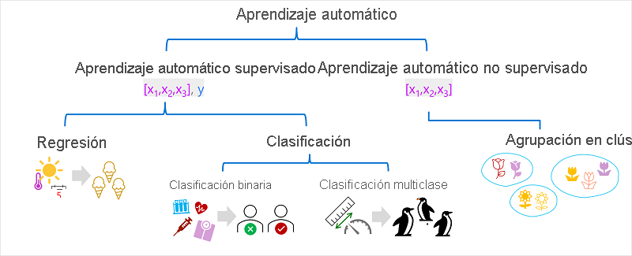
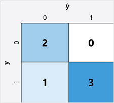

# El aprendizaje automático
Es de muchas maneras la intersección de dos materias: la ciencia de datos y la ingeniería de software. El objetivo del aprendizaje automático es usar datos para crear un modelo predictivo que se pueda incorporar a una aplicación o servicio de software.

## ¿Qué es el aprendizaje automático?
Tiene sus orígenes en las estadísticas y el modelado matemático de los datos. La idea fundamental del aprendizaje automático es usar datos de observaciones anteriores para predecir resultados o valores desconocidos.

## Aprendizaje automático como una función
un modelo de aprendizaje automático es una aplicación de software que encapsula una función para calcular un valor de salida basado en uno o varios valores de entrada. 

## Tipos de aprendizaje automático

### Aprendizaje automático supervisado
El aprendizaje automático supervisado es un término general para los algoritmos de aprendizaje automático en los que **los datos de entrenamiento incluyen valores de características y valores de etiqueta conocidos**

El aprendizaje automático supervisado se utiliza para entrenar modelos determinando **una relación entre las características y las etiquetas en observaciones pasadas**, de modo que **puedan predecirse etiquetas desconocidas para las características en casos futuros.**

#### Regresión
Es una forma de aprendizaje automático supervisado en la que la etiqueta predicha por el modelo es un valor numérico.

#### Clasificación
La clasificación es una forma de aprendizaje automático supervisado en el que la etiqueta representa una categorización o clase

- **Clasificación binaria**: la etiqueta determina si el elemento observado es (o no) una instancia de una clase específica. el modelo predice de **forma binaria verdadero/falso o positivo/negativo** para una **única clase posible**.
- **Clasificación multiclase**: La clasificación multiclase amplía la clasificación binaria para predecir **una etiqueta que representa una de varias clases posibles.** En la mayoría de los escenarios que implican un conjunto conocido de varias clases, **la clasificación multiclase se usa para predecir etiquetas mutuamente excluyentes.**

### Aprendizaje automático no supervisado
El aprendizaje automático no supervisado implica entrenar modelos mediante **datos que solo constan de valores de características sin etiquetas conocidas.** 
- **Clustering**: Un algoritmo de agrupación en clústeres **identifica similitudes entre observaciones en función de sus características** y las agrupa en clústeres discretos.

### Diferencia entre **clasificación multiclase** y **clústeres** 
Es que cuando se utiliza la **clasificación**, ya **se conocen las clases a las que pertenecen las observaciones de los datos de entrenamiento**; por lo tanto, el algoritmo funciona determinando la relación entre las características y la etiqueta de clasificación conocida. En la **agrupación en clústeres**, **no hay una etiqueta de clúster previamente conocida** y el algoritmo **agrupa las observaciones de datos basándose exclusivamente en la similitud de las características**.

## Regresión
### Métricas de evaluación de regresión
En función de las diferencias entre los valores previstos y reales, puede calcular algunas métricas comunes que se usan para evaluar un modelo de regresión.

- **Error medio absoluto (MAE)**
- **Error cuadrático medio (MSE)**
- **Raíz del error cuadrático medio (RMSE)**
- **Coeficiente de determinación (R2)**

## Clasificación binaria
### Entrenamiento de un modelo de clasificación binaria
Para entrenar el modelo, usaremos un algoritmo para ajustar los datos de entrenamiento a una función que calcula la probabilidad de que la etiqueta de clase sea verdadera

La probabilidad se mide como un valor entre 0,0 y 1,0, de modo que la probabilidad total de todas las clases posibles es 1,0. Así, por ejemplo, si la probabilidad de que un paciente tenga diabetes es de 0,7, existe una probabilidad correspondiente de 0,3 de que el paciente no sea diabético.

Hay muchos algoritmos que se pueden usar para la clasificación binaria, como la regresión logística, que deriva una sigmoide (en forma de S) con valores entre 0,0 y 1,0

A pesar de su nombre, en el aprendizaje automático **la regresión logística se usa para la clasificación, no para la regresión**. El punto importante es la naturaleza logística de la función que genera, que describe una curva en forma S entre un valor inferior y superior (0,0 y 1,0 cuando se usa para la clasificación binaria).

### Métricas de evaluación de clasificación binaria
El primer paso para calcular las métricas de evaluación para un modelo de clasificación binaria suele ser crear una matriz del número de predicciones correctas e incorrectas para cada etiqueta de clase posible:

Esta visualización se denomina matriz de confusión y muestra los totales de predicción donde:

- ŷ=0 e y=0: Verdaderos negativos (TN por sus siglas en inglés)
- ŷ=1 e y=0: Falsos positivos (FP por sus siglas en inglés)
- ŷ=0 e y=1: Falsos negativos (FN por sus siglas en inglés)
- ŷ=1 e y=1: Verdaderos positivos (TP por sus siglas en inglés)

La disposición de la matriz de confusión es tal que las predicciones correctas (verdaderas) se muestran en una línea diagonal de la parte superior izquierda a la derecha. 

### Precisión | Recall

La métrica más sencilla que se puede calcular a partir de la matriz de confusión es la precisión: la proporción de predicciones que el modelo acertó. La precisión se calcula como:

**(TN+TP) ÷ (TN+FN+FP+TP)**

### Coincidencia
Coincidencia es una métrica que mide la proporción de casos positivos que el modelo identificó correctamente0

La fórmula para la coincidencia es:

**TP ÷ (TP+FN)**

### Precision
Es una métrica similar a la coincidencia, pero mide la proporción de casos positivos predichos en los que la etiqueta verdadera es realmente positiva.

La fórmula de precisión es:

**TP ÷ (TP+FP)**

### Puntuación F1
Puntuación F1 es una métrica global que combina coincidencia y precisión. La fórmula de la puntuación F1 es:

**(2 x Precision x Recall) ÷ (Precision + Recall)**

### Área bajo la curva (AUC)
Es una métrica utilizada en estadística y aprendizaje automático para evaluar el rendimiento de un modelo de clasificación binaria. Esta métrica se calcula a partir de la curva ROC (Receiver Operating Characteristic), que ilustra la relación entre la tasa de verdaderos positivos (TPR o sensibilidad) y la tasa de falsos positivos (FPR o 1 - especificidad) a diferentes umbrales de decisión del modelo.

## Clasificación multiclase
### Entrenamiento de un modelo de clasificación multiclase
Para entrenar un modelo de clasificación multiclase, es necesario usar un algoritmo para ajustar los datos de entrenamiento a una función que calcule un valor de probabilidad para cada clase posible. 
#### Algoritmos Uno frente a todos (OvR)
Los algoritmos de tipo Uno frente a todos entrenan una función de clasificación binaria para cada clase, y en cada una se calcula la probabilidad de que la observación sea un ejemplo de la clase de destino.

- **f0(x) = P(y=0 | x)**
- **f1(x) = P(y=1 | x)**
- **f2(x) = P(y=2 | x)**

#### Algoritmos multinomiales
rea una única función que devuelve una salida multivalor. La salida es un vector (una matriz de valores) que contiene la distribución de probabilidad para todas las clases posibles, con una puntuación de probabilidad para cada clase que, cuando se totaliza, suma hasta 1,0:

**f(x) =[P(y=0|x), P(y=1|x), P(y=2|x)]**

Un ejemplo de este tipo de función es softmax, que podría generar una salida como la del ejemplo siguiente:

**[0.2, 0.3, 0.5]**

### Evaluación de un modelo de clasificación multiclase
La matriz de confusión de un clasificador multiclase es similar a la de un clasificador binario, salvo que muestra el número de predicciones para cada combinación de las etiquetas de clase predicha (ŷ) y real (y):

## Agrupación en clústeres
### Entrenamiento de un modelo de agrupación en clústeres
Hay varios algoritmos que puede usar para la agrupación en clústeres. Uno de los algoritmos más usados es la **agrupación en clústeres k-mean**

- **Vectorización**: Se convierten las características en coordenadas de n dimensiones (por ejemplo, [x1, x2] para dos características como número de hojas y pétalos de una flor).
- **Definición de k**: Se elige cuántos clústeres (k) se desean. Por ejemplo, con k=3, se inician 3 centroides en coordenadas aleatorias.
- **Asignación inicial**: Cada punto de datos se asigna al centroide más cercano.
- **Ajuste de centroides**: Los centroides se recalculan moviéndose al centro de los puntos asignados.
- **Reasignación**: Los puntos se reasignan según el centroide más cercano tras el movimiento.
- **Repetición**: Los pasos de ajuste y reasignación se repiten hasta estabilizar los clústeres o alcanzar un número máximo de iteraciones.

### Evaluación de un modelo de clústeres
Puesto que no hay ninguna etiqueta conocida con la que comparar las asignaciones de clúster previstas, la evaluación de un modelo de agrupación en clústeres se basa en el nivel de separación entre sí de los clústeres resultantes.

Hay varias métricas que puede usar para evaluar la separación del clúster, entre las que se incluyen:

- **Distancia media al centro del clúster**: la proximidad media de cada punto del clúster al centroide del clúster.
- **Distancia media a otro centro**: la distancia media entre cada punto del clúster y el centroide de todos los demás clústeres.
- **Distancia máxima al centro del clúster**: la distancia más lejana entre un punto del clúster y su centroide.
- **Silueta**: un valor entre -1 y 1 que resume la relación de distancia entre puntos del mismo clúster y puntos de diferentes clústeres (cuanto más cerca de 1, mejor será la separación del clúster).

## Aprendizaje profundo
Es una forma avanzada de aprendizaje automático que intenta **emular el modo en que el cerebro humano aprende**. La clave del aprendizaje profundo es la creación de **una red neuronal artificial** que simula la actividad electroquímica de las neuronas biológicas mediante el uso de funciones matemáticas.

Las redes neuronales artificiales se componen de varias capas de neuronas, básicamente definiendo una función profundamente anidada.

los modelos que producen suelen denominarse **redes neuronales profundas (DNN)**

### ¿Cómo aprende una red neuronal?
Los pesos de una red neuronal son fundamentales para calcular los valores previstos de las etiquetas. Durante el proceso de entrenamiento, el modelo aprende los pesos que darán lugar a las predicciones más precisas.

## Azure Machine Learning
Es un servicio en la nube para entrenar, implementar y administrar modelos de Machine Learning.

### Características y capacidades de Azure Machine Learning
- Almacenamiento centralizado y administración de conjuntos de datos para el entrenamiento y la evaluación del modelo.
- Recursos de proceso a petición en los que puede ejecutar trabajos de aprendizaje automático, como entrenar un modelo.
- Aprendizaje automático automatizado (AutoML), lo que facilita la ejecución de varios trabajos de entrenamiento con diferentes algoritmos y parámetros para encontrar el mejor modelo para los datos.
- Herramientas visuales para definir canalizaciones orquestadas para procesos como el entrenamiento del modelo o la inferencia.
- Integración con marcos de aprendizaje automático comunes, como MLflow, lo que facilita la administración del entrenamiento, la evaluación y la implementación del modelo a escala.
- Compatibilidad integrada para visualizar y evaluar métricas de inteligencia artificial responsable, incluida la explicación del modelo, la evaluación de equidad y otras.

### Aprovisionamiento de recursos de Azure Machine Learning
El recurso principal necesario para Azure Machine Learning es un **área de trabajo de Azure Machine Learning**, que puede aprovisionar en una suscripción de Azure. 

### Azure Machine Learning Studio
En Estudio de Azure Machine Learning, puede (entre otras cosas):
- Importar y explorar los datos.
- Crear y usar recursos de proceso.
- Ejecutar código en cuadernos.
- Usar herramientas visuales para crear trabajos y canalizaciones.
- Usar el aprendizaje automático de máquinas para entrenar modelos.
- Ver los detalles de los modelos entrenados, incluidas las métricas de evaluación, la información sobre la IA responsable y los parámetros de entrenamiento.
- Implementar modelos entrenados para inferencias a petición y por lotes.
- Importar y administrar modelos a partir de un completo catálogo de modelos.